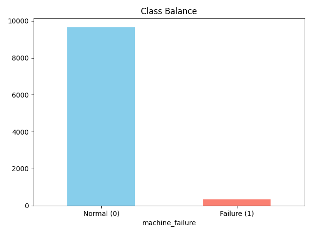
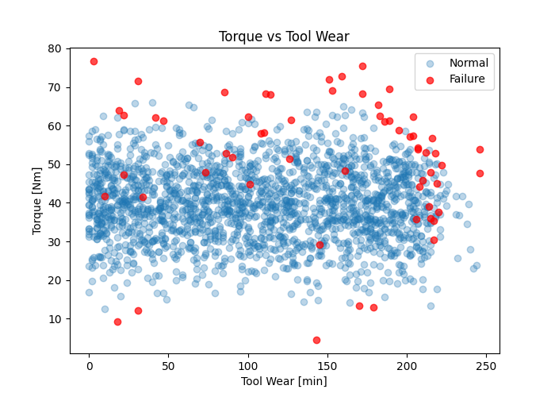
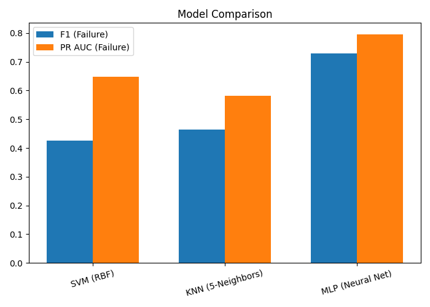
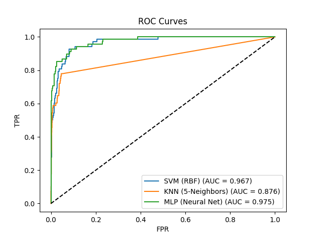
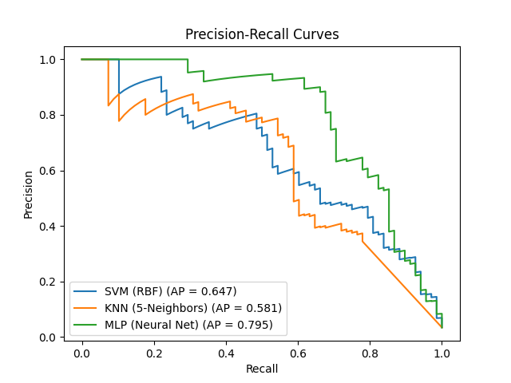
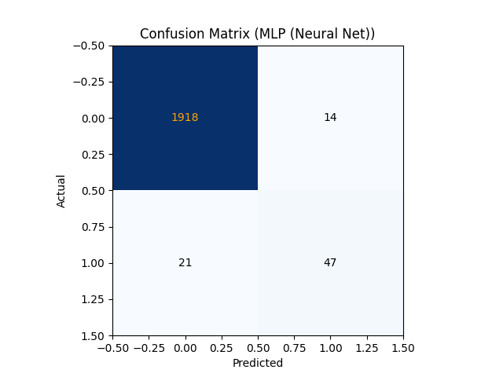
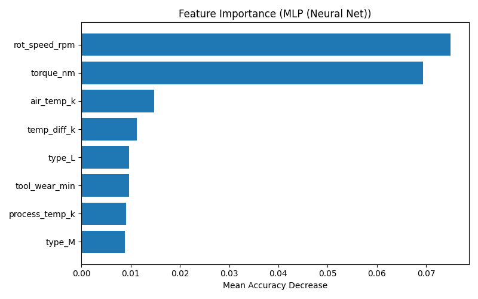

# Predicting Machine Failures with SVM, KNN, and MLP
_A Benchmark on the AI4I 2020 Predictive Maintenance Dataset_

**Author:** Mahesh  
**Date:** 2025-12-01

---

## TL;DR
I benchmarked **SVM**, **KNN**, and **MLP (Neural Networks)** to predict machine failures using sensor data. 
The **MLP (Neural Net)** model performed best, achieving an F1-score of **0.729** on the failure class.

---

## Hardware & Software Requirements

**Hardware:**
*   Standard CPU (Intel i5/AMD Ryzen 5 or better recommended)
*   4GB+ RAM (8GB recommended)
*   500MB free disk spaces

**Software:**
*   Python 3.8+
*   OS: Windows, macOS, or Linux

**Python Libraries:**
*   `pandas`
*   `scikit-learn`
*   `matplotlib`
*   `numpy`

---

## How to Reproduce

1.  **Download the Dataset**: Ensure `ai4i2020.csv` is in this folder.
2.  **Install Dependencies**:
    ```bash
    pip install pandas scikit-learn matplotlib numpy
    ```
3.  **Run the Script**:
    ```bash
    python run_bot.py
    ```
4.  **View Results**: The script generates all the images below and this README file.

---

## 1. Dataset Overview
The dataset contains 10,000 data points representing a milling machine.

*   **Features:** Air Temp, Process Temp, Rotational Speed, Torque, Tool Wear, Type.
*   **Target:** Machine Failure (0 = Normal, 1 = Failure).
*   **Imbalance:** Failures are rare (~3.4%).

### Class Balance


### Data Insights (Torque vs Tool Wear)


---

## 2. Model Performance

I compared three models using **Standard Scaling** and **Class Weighting** (where applicable) to handle the imbalance.

| Model | F1 (Failure) | ROC AUC | PR AUC | Accuracy |
|-------|--------------|---------|--------|----------|
| SVM (RBF) | 0.426 | 0.967 | 0.647 | 0.915 |
| KNN (5-Neighbors) | 0.463 | 0.876 | 0.581 | 0.975 |
| MLP (Neural Net) | 0.729 | 0.975 | 0.795 | 0.983 |


### Performance Metrics Comparison


### ROC Curves


### Precision-Recall Curves


---

## 3. Best Model Analysis: MLP (Neural Net)

The best model was selected based on the **F1-Score for the Failure Class**, as catching failures is the priority.

### Confusion Matrix
This shows exactly how many failures were caught (True Positives) vs missed (False Negatives).


### Feature Importance (Permutation)
Using Permutation Importance to see which sensors mattered most to the model.


---

## 4. Conclusion
*   **Neural Networks (MLP)** and **Distance-based (KNN)** methods worked effectively.
*   **Torque** and **Tool Wear** are the strongest predictors of failure.
*   Standardization of data was crucial for these algorithms.
